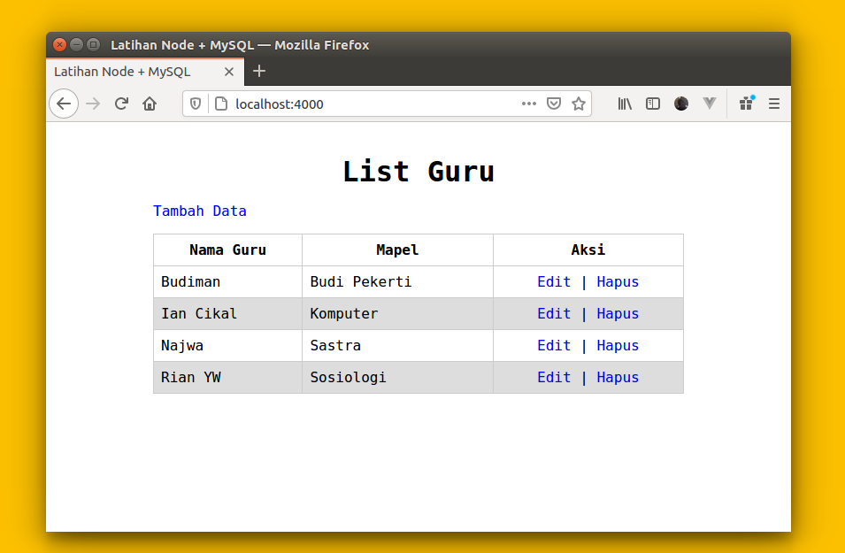

# Node MySQL (CRUD)



Contekan buat temen-temen yang mau latihan, belajar program dasar dengan menggunakan NodeJS dan Database.

Dependencies / modul yang akan kita gunakan:

* Express (buat routing)
* EJS (buat view)
* MySQL2 (buat handle database)

## Instalasi

```bash
git clone https://github.com/cikaldev/node-mysql-crud.git
cd node-mysql-crud
npm install
```

Setelah proses instalasi modul di atas selesai, silahkan import file **dummy.sql** untuk membuat database dan tabel.

## Running

```bash
npm start
```

Silahkan akses url nya `http://localhost:4000` via browser.

Semoga bermanfaat.
